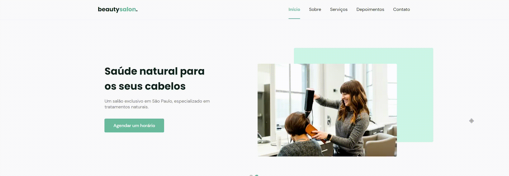

# Origin Six - Next Level Week Together
 Origin six é projeto de uma aplicação web (Beauty Salon) proporcionado pela [rocketseat]((https://discord.gg/gKUVrzrPrU)) durante a NLW Together.

### :computer: Web:

### :iphone: Mobile:

---
### :computer: Projeto
Beauty Salon é um site de uma empresa fictícia que simula um salão de beleza, onde o cliente pode agendar horário, ter acesso aos serviços oferecidos, depoimentos e contato!

### :sparkles: Tecnologias
Esse projeto foi desenvolvido com as seguintes tecnologias:

  

###### :books: Bibliotecas:
- [Google Fonts](https://fonts.google.com/)
- [SwipeJS](https://github.com/nolimits4web/Swiper)
- [ScrollRevel](https://scrollrevealjs.org)

###### :gear: Utilitários:
- [randomuser.me](https://randomuser.me/photos)
- [IconMoon](https://icomoon.io/app/#/select)

### :scroll: Aprendizado
- Boas práticas com HTML e CSS
- Aprimorei a prática com variáveis no css
- O processo de desenvolver primeiro o mobile first para desktop 
- Animações com Javascript
- Swiper manual com cards

### :bookmark: Layout
Você pode visualizar o layout do projeto através [desse link](https://www.figma.com/community/file/1009807319507822993/Origin-Six). É necessário ter conta no [Figma](https://figma.com) para acessá-lo.

> Status do projeto: concluído :white_check_mark:
